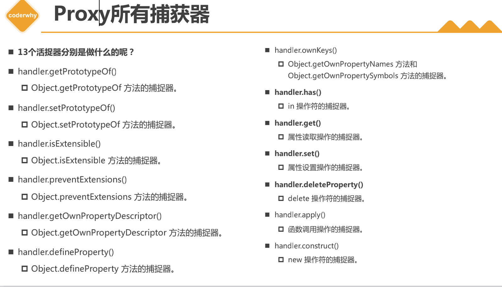

# Proxy和Reflect

## 1. Proxy基本使用

### 1. defineProperty

1. 如果想监听对象里的属性，可以借助Object.defineProperty中的存取描述符getter和setter去监听对象属性的操作
2. 但是我们直接删除或新增一个对象属性，Object.defineProperty是无法做到的
3. 其设计初衷还是给对象设置各种描述符的，而不是去监听对象的各种操作
4. 利用Object.defineProperty时，需要注意不能在存取描素符中获取或设置该对象属性， 否则会造成死循环

```js
const obj = {
  name: 'gt',
  age:18
}

/**
 * forEach中如果需要传递this, 需要使用匿名函数，箭头函数没有this
 */

Object.keys(obj).forEach(function(key) {
  let currentValue = obj[key]
  Object.defineProperty(obj, key, {
    /**
     * getter setter描述符不能再从其对象本身获取属性 或设置属性，否则会死循环
     * 一般使用闭包实用自由变量代替存取对象属性
     */
    get: function() {
      console.log('获取属性', currentValue)
      return currentValue
    },
    set: function(value) {
      console.log('设置属性', value)
      if (value === currentValue) return
      currentValue = value
    }
  })
}, obj)

obj.name = 'gt1'
console.log(obj.name)
```


### 2.Proxy

1. es6中新增Proxy类，用于创建代理对象
   * 如果需要监听一个对象的操作，先创建代理对象
   * 之后所有对该对象的操作，都通过代理对象去完成
2. 基本使用
   * 通过new Proxy(被代理对象，{捕获器}) 创建代理对象
   * 捕获器
     * get捕获器, 是一个函数 共三个参数：
       * target 被代理对象
       * property 被获取属性的key
       * recriver 调用的代理对象
     * set捕获器，是一个函数 共四个参数：
       * target 被代理对象
       * property 被设置属性的key
       * value 新属性值
       * receiver 调用的代理对象	

```js
const obj = {
  name: 'gt',
  age:18
}

/**
 * forEach中如果需要传递this, 需要使用匿名函数，箭头函数没有this
 */

Object.keys(obj).forEach(function(key) {
  let currentValue = obj[key]
  Object.defineProperty(obj, key, {
    /**
     * getter setter描述符不能再从其对象本身获取属性 或设置属性，否则会死循环
     * 一般使用闭包实用自由变量代替存取对象属性
     */
    get: function() {
      console.log('获取属性', currentValue)
      return currentValue
    },
    set: function(value) {
      console.log('设置属性', value)
      if (value === currentValue) return
      currentValue = value
    }
  })
}, obj)

obj.name = 'gt1'
console.log(obj.name)
```


* proxy所有捕获器

  

  